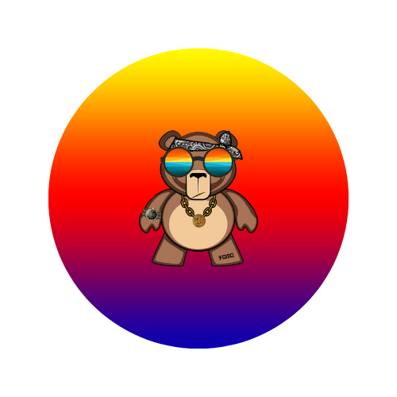

<div id="top"></div>

<!-- PROJECT LOGO -->
<div align="center">
  
  <h3 align="center"><strong>NFT-Art-Generator</strong></h3>
  <p align="center">
    A fun Python program that allows you to ride the NFT wave and algorithmically generate art collections directly from a Photoshop .psd file!
    <br>
  </p>
  <p align="center">
    <strong>Features Include:</strong><br>
    True random or specified element rarity<br>
    Direct integration with the Adobe Photoshop application
  </p>
</div>

___

<!-- TABLE OF CONTENTS -->
### Table of Contents
<details>
  <ol>
    <li><a href="#getting-started">Getting Started</a></li>
    <li><a href="#usage">Usage</a></li>
    <li><a href="#demo">Demo</a></li>
  </ol>
</details>
<br>


<!-- GETTING STARTED -->
<div id="getting-started"></div>

## Getting Started

1. **IMPORTANT:** Make sure that you are using a Windows machine. Unfortunately the software only works on Windows operating systems.

2. Install the [Adobe Photoshop](https://www.adobe.com/products/photoshop.html?promoid=RL89NFBP&mv=other) software from Adobe Creative Cloud.

3. Clone the repo
   ```sh
   git clone https://github.com/hschickdevs/NFT-Art-Generator.git
   ```
4. Install pip packages
   ```sh
   pip install -r requirements.txt
   ```

<p align="right">(<a href="#top">back to top</a>)</p>


<!-- USAGE EXAMPLES -->
<div id="usage"></div>

## Usage

_For a detailed usage guide, please refer to the [Documentation](https://github.com/hschickdevs/NFT-Art-Generator/blob/main/resources/NFT%20Art%20Generator%20-%20Usage%20Guide.pdf)_

### Setup

- To run the software, navigate to the directory to which this repository was cloned, and run:
   ```sh
   python main.py
   ```
- For testing, you can use the sample [NFT-Official.psd](https://github.com/hschickdevs/NFT-Art-Generator/blob/main//resources/NFT-Official.psd) file provided in the repository as your input file.

### Output

- You should see the two following folders in your selected output folder:
  - `Exported_CSV_Data`: Contains a CSV datafile showing which elements from the .psd file were selected for each NFT art image generated.
  - `Generated_NFT_Images`: Contains all of the generated images in .PNG format.

<p align="right">(<a href="#top">back to top</a>)</p>


<!-- DEMO -->
<div id="demo"></div>

## Demo

### Operation Setup


### Setting Element Rarities


### Generating Art Collection


### Viewing Output


<p align="right">(<a href="#top">back to top</a>)</p>